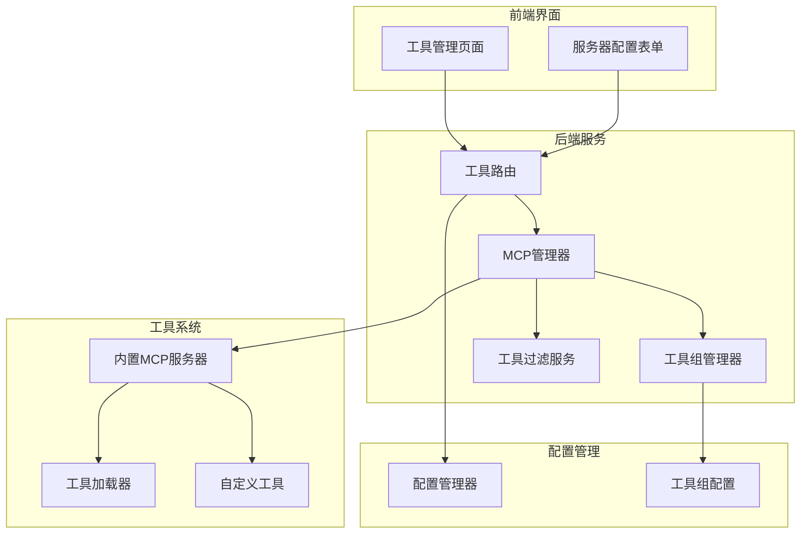
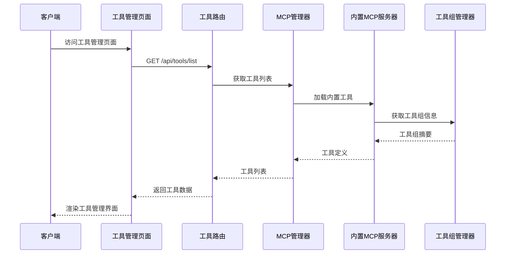
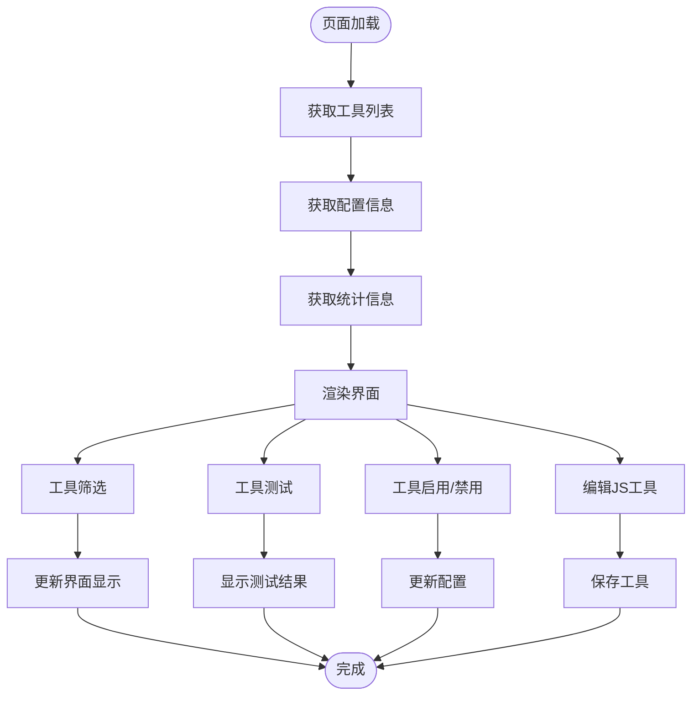
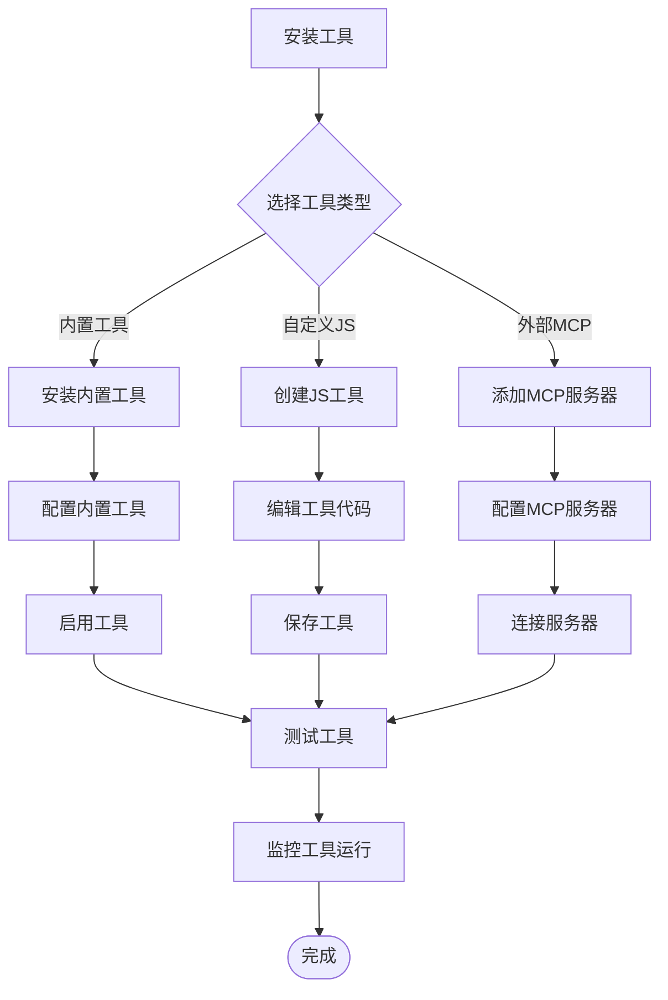
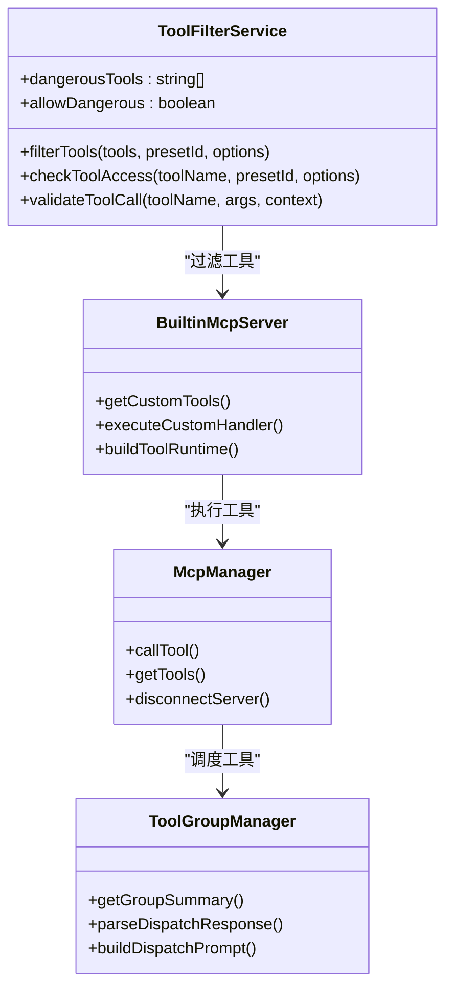
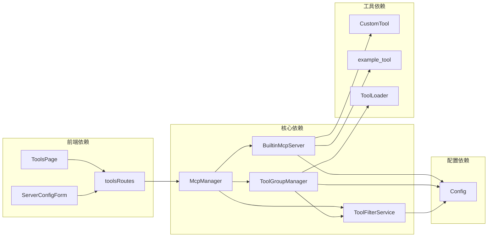

# 工具管理页面

## 目录
1. [项目概述](#项目概述)
2. [项目结构](#项目结构)
3. [核心组件](#核心组件)
4. [架构概览](#架构概览)
5. [详细组件分析](#详细组件分析)
6. [依赖关系分析](#依赖关系分析)
7. [性能考虑](#性能考虑)
8. [故障排除指南](#故障排除指南)
9. [结论](#结论)

## 项目概述

工具管理页面是 ChatAI Plugin 插件的核心功能模块，负责管理、配置和监控各种工具的安装、启用和运行状态。该系统支持多种工具类型，包括内置工具、自定义JS工具和外部MCP服务器工具，提供了完整的工具生命周期管理功能。

## 项目结构

**图表来源**
- [toolsRoutes.js](file://src/services/routes/toolsRoutes.js#L1-L705)
- [McpManager.js](file://src/mcp/McpManager.js#L1-L1268)
- [ToolGroupManager.js](file://src/services/tools/ToolGroupManager.js#L1-L579)

**章节来源**
- [toolsRoutes.js](file://src/services/routes/toolsRoutes.js#L1-L705)
- [page.tsx](file://frontend/app/(dashboard)/tools/page.tsx#L1-L1582)

## 核心组件

### 工具路由系统

工具路由系统提供了完整的REST API接口，支持工具的CRUD操作、配置管理和状态监控：

- **工具列表管理**：获取所有工具、内置工具和自定义工具
- **配置管理**：内置工具配置、危险工具配置、事件概率配置
- **工具操作**：启用/禁用、测试、热重载、批量操作
- **状态监控**：工具统计、日志管理、服务器状态

### 工具组管理器

工具组管理器负责工具的分类、分组和调度管理：

- **工具分类**：按功能类别组织工具（基础工具、用户信息、群组管理等）
- **分组调度**：支持工具组的组合使用和依赖关系管理
- **动态加载**：支持热重载和动态工具发现
- **兼容性检查**：工具依赖关系验证和冲突检测

### 工具过滤服务

工具过滤服务提供多层次的安全控制和权限管理：

- **白名单/黑名单**：工具启用/禁用策略
- **危险工具防护**：敏感操作的安全保护
- **权限控制**：基于用户角色的工具访问控制
- **参数验证**：工具调用参数的安全验证

**章节来源**
- [ToolGroupManager.js](file://src/services/tools/ToolGroupManager.js#L1-L579)
- [ToolFilterService.js](file://src/services/tools/ToolFilterService.js#L1-L314)

## 架构概览

**图表来源**
- [toolsRoutes.js](file://src/services/routes/toolsRoutes.js#L19-L30)
- [McpManager.js](file://src/mcp/McpManager.js#L561-L600)
- [BuiltinMcpServer.js](file://src/mcp/BuiltinMcpServer.js#L623-L676)

## 详细组件分析

### 工具管理页面前端实现

工具管理页面采用React构建，提供了直观的工具管理界面：

**图表来源**
- [page.tsx](file://frontend/app/(dashboard)/tools/page.tsx#L174-L541)

### 工具分类体系

系统支持 22 个主要工具类别，每个类别都有明确的功能定位；具体工具数量会随源码变动，以下统计以当前源码和管理面板为准：

| 类别 | 工具条目 | 主要功能 | 安全等级 |
|------|----------|----------|----------|
| 基础工具 | 9 | 时间获取、环境信息、工具列表 | 低 |
| 用户信息 | 9 | 用户资料、好友列表、头像、点赞等 | 低 |
| 群组信息 | 10 | 群组信息、成员列表、成员搜索 | 低 |
| 消息操作 | 37 | 消息发送、@用户、聊天记录、合并转发、协议包 | 低 |
| 群管理 | 19 | 禁言、踢人、群名片、公告、管理员 | 高 |
| 群统计 | 14 | 群等级、龙王、发言排行、活跃统计 | 低 |
| 文件操作 | 30 | 群文件、私聊文件、本地文件读写、下载 | 中 |
| 网页访问 | 2 | 网页内容获取、URL 抓取 | 低 |
| 搜索工具 | 17 | 搜索、翻译、百科、天气、热搜 | 低 |
| 实用工具 | 25 | 计算、随机、编码、哈希、文本处理 | 低 |
| 记忆管理 | 5 | 用户记忆增删改查与搜索 | 低 |
| 上下文管理 | 6 | 对话上下文、引用消息、@列表 | 低 |
| 媒体处理 | 23 | 图片、视频、音乐、表情、二维码 | 低 |
| Bot信息 | 12 | 登录信息、状态、版本、能力检测 | 低 |
| 语音/声聊 | 16 | TTS、AI 声聊、语音识别与转换 | 低 |
| 扩展工具 | 9 | 天气、一言、骰子、倒计时、短链、插画 | 低 |
| 系统命令 | 5 | Shell 命令、系统信息、进程与环境变量 | 危险 |
| 定时任务 | 3 | 自然语言定时任务创建、取消、列表 | 中 |
| 扩展工具集 | 11 | QQ 音乐、表情包、B站、GitHub、AI 图片编辑 | 低 |
| 定时提醒 | 3 | 设置、查看、取消提醒 | 低 |
| 绘图服务 | 5 | 文生图、视频生成、绘图预设 | 中 |
| QQ空间/说说 | 10 | 说说发布、动态获取、点赞、个签、戳一戳 | 中 |

**章节来源**
- [index.js](file://src/mcp/tools/index.js#L30-L58)
- [TOOLS.md](file://docs/TOOLS.md#L625-L729)

### 工具安装和配置流程

**图表来源**
- [toolsRoutes.js](file://src/services/routes/toolsRoutes.js#L191-L269)
- [page.tsx](file://frontend/app/(dashboard)/tools/page.tsx#L323-L421)

### 权限配置和安全控制

系统实现了多层次的安全控制机制：

**图表来源**
- [ToolFilterService.js](file://src/services/tools/ToolFilterService.js#L28-L314)
- [BuiltinMcpServer.js](file://src/mcp/BuiltinMcpServer.js#L682-L800)
- [McpManager.js](file://src/mcp/McpManager.js#L724-L800)

**章节来源**
- [ToolFilterService.js](file://src/services/tools/ToolFilterService.js#L12-L314)
- [config.js](file://config/config.js#L256-L266)

### 工具监控和日志管理

系统提供了完善的工具监控和日志管理功能：

| 监控指标 | 数据来源 | 更新频率 | 存储方式 |
|----------|----------|----------|----------|
| 工具调用次数 | 工具执行日志 | 实时 | 内存缓存 |
| 工具执行时间 | 工具执行结果 | 实时 | 内存缓存 |
| 工具成功率 | 工具执行结果 | 实时 | 内存缓存 |
| 工具错误率 | 工具执行结果 | 实时 | 内存缓存 |
| 工具使用统计 | 工具调用日志 | 每日 | 文件存储 |

**章节来源**
- [toolsRoutes.js](file://src/services/routes/toolsRoutes.js#L459-L485)
- [McpManager.js](file://src/mcp/McpManager.js#L778-L800)

## 依赖关系分析

**图表来源**
- [McpManager.js](file://src/mcp/McpManager.js#L1-L1268)
- [BuiltinMcpServer.js](file://src/mcp/BuiltinMcpServer.js#L1-L1462)
- [ToolGroupManager.js](file://src/services/tools/ToolGroupManager.js#L1-L579)

**章节来源**
- [McpManager.js](file://src/mcp/McpManager.js#L1-L1268)
- [BuiltinMcpServer.js](file://src/mcp/BuiltinMcpServer.js#L1-L1462)

## 性能考虑

### 工具加载优化

系统采用了多种性能优化策略：

- **懒加载机制**：工具模块按需加载，减少初始启动时间
- **缓存策略**：工具定义和配置信息缓存，避免重复加载
- **热重载优化**：文件监听器防抖处理，避免频繁重载
- **内存管理**：工具执行结果缓存，支持TTL过期机制

### 并发处理

系统支持工具的并发执行：

- **并行执行**：多个工具可以并行执行，提高响应速度
- **队列管理**：工具调用排队机制，避免资源竞争
- **超时控制**：工具执行超时检测和处理
- **错误恢复**：工具执行失败的自动重试机制

## 故障排除指南

### 常见问题诊断

| 问题类型 | 症状 | 诊断方法 | 解决方案 |
|----------|------|----------|----------|
| 工具无法加载 | 工具列表为空 | 检查工具文件格式 | 修复工具定义格式 |
| 工具执行失败 | 工具返回错误 | 查看工具执行日志 | 检查工具参数和权限 |
| 工具配置错误 | 工具被禁用 | 检查配置文件 | 修正配置项 |
| 热重载失效 | 工具修改不生效 | 检查文件监听器 | 重启文件监听器 |
| 权限不足 | 工具调用被拒绝 | 检查用户权限 | 提升用户权限级别 |

### 调试工具

系统提供了多种调试工具：

- **调试模式**：启用详细日志输出
- **工具测试**：在线测试工具执行
- **配置验证**：配置项有效性检查
- **性能监控**：工具执行性能分析

**章节来源**
- [page.tsx](file://frontend/app/(dashboard)/tools/page.tsx#L581-L588)
- [TOOLS.md](file://docs/TOOLS.md#L771-L800)

## 结论

工具管理页面提供了完整的工具生命周期管理功能，包括工具安装、配置、监控和故障排除。系统采用模块化设计，支持多种工具类型和灵活的配置管理。通过多层次的安全控制和性能优化，确保了工具系统的稳定性和安全性。

建议的最佳实践包括：
- 定期备份工具配置和数据
- 使用白名单模式限制工具访问
- 启用危险工具保护机制
- 定期检查工具执行日志
- 合理配置工具重载策略
